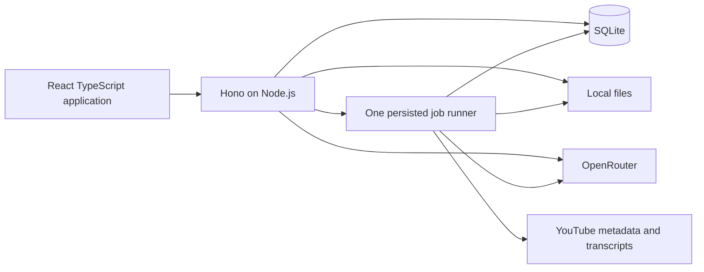

# TubeAtlas implementation plan

Status: implementation specification, updated October 3, 2026. The target application is entirely TypeScript/Node.js; Python/FastAPI are not part of its runtime, tooling, or deployment. [Knowledge-graph extraction and evaluation requirements](knowledge-graph-quality.md) are a required part of this plan.

## 1. Product and scope

Build a personal knowledge hub where a YouTube video becomes a durable workspace: watch, read, explore concepts, ask questions, and keep useful documents. Generating explanatory images (Visual Studio) is an optional later milestone, not part of the first release.

The first release is single-user, local-first, desktop-only, and served on localhost. AI and YouTube still require internet access; stored notes, transcripts, and graphs remain readable without it. Public hosting, accounts, teams, synchronization, and large channel ingestion are separate future decisions. This narrower release scope supersedes the original PRD's large-scale channel-processing targets.

Because there is exactly one user on one machine, prefer simple behavior over distributed-systems safeguards: no idempotency keys, revision conflicts, stream resumption, or backup tooling. The exception is paid AI calls, which are never replayed automatically.

The approved visual references are [the five focused views](../output/ui-concepts/focused-views/). Their layout and warm visual style are the reference; their illustrative text, graph relationships, and diagrams are not factual fixtures. The Visual Studio view stays a design reference until its optional milestone.

The main user journey is:

1. Import a video into a topic.
2. Watch it beside a timestamped transcript.
3. Ask about a passage or explore its concepts.
4. Save an answer into a document.
5. Return later through the library, topics, or search.

Success means this journey works reliably with persisted data, including after restart. A screen that only displays fixture data is not a completed feature.

## 2. Architecture decisions

| Area | Decision | Purpose |
| --- | --- | --- |
| Frontend | React + TypeScript + Vite | Small static application; no server-rendering framework needed. |
| Navigation | React Router | Deep links, back/forward, and explicit video workspace routes. |
| Styling | Plain CSS, shared variables, a few reusable controls | Match the approved design without a component framework or animation package. |
| Graph | Cytoscape.js directly, no React wrapper or layout plugins initially | Labels, edges, selection, pan/zoom, and built-in layouts in one graph dependency. |
| Documents | Markdown source, simple formatting toolbar, rendered preview | Portable editable text without building a rich-text editor. |
| Markdown rendering | react-markdown; raw HTML disabled | Render notes and AI answers without a custom parser. |
| Runtime | Node.js 26 (newest release line), TypeScript throughout; one root package.json and one lockfile; Node runs the server's TypeScript directly | One language and toolchain for frontend, API, jobs, migrations, and evaluation. |
| API | Hono + Node adapter + Zod; Hono typed client | Shared request/response types with runtime validation; no generated Python-to-TS client. |
| Persistence | SQLite through better-sqlite3, explicit parameterized SQL | One embedded database driver; no ORM or database service. |
| Schema changes | Ordered SQL migrations tracked by version/checksum; a small Node migration script | Evolve the new schema without an ORM or Python tooling. |
| Files | Managed local data directory | Uploads survive restarts without object storage. |
| AI | One native-fetch OpenRouter adapter for chat, streaming, embeddings, and structured output; no SDK | One small server-only integration module with no hidden retries and full control over OpenRouter fields. |
| KG model | `openai/gpt-6-astra` via OpenRouter, `reasoning: { effort: "low" }` | User-required extraction model; no silent model or effort substitution. |
| Retrieval | Timestamped chunks + embeddings in SQLite; cosine scoring with Float32Array in TypeScript | Scoped retrieval without NumPy, FAISS, or a vector server. |
| Jobs | SQLite job records + one bounded runner in the Node process | Durable import/generation status without Redis or Celery. |
| Delivery | Built frontend served by Hono, one origin and one Node process | One application to run and back up. |



Run one Node process, without clustering. HTTP/provider calls are asynchronous; graph layouts run in the browser. better-sqlite3 queries are synchronous, so bound query sizes, index lookups, and keep transactions short; never perform network calls in a transaction. Yield between CPU-heavy batches; introduce a Node worker thread only if measured event-loop stalls justify it. Enable foreign keys, WAL, and a bounded busy timeout. SQLite WAL permits readers alongside a writer, but still only one writer at a time; this is a single-machine deployment. [SQLite WAL documentation](https://www.sqlite.org/wal.html)

Hono's typed client imports only the API type, never server implementation or secrets. Zod validates network inputs and AI outputs; TypeScript types alone are not runtime validation. Use one shared Zod definition for each contract and infer types from it. Explicitly type expected error responses. [Hono RPC documentation](https://hono.dev/docs/guides/rpc)

Cytoscape provides styling and graph layouts without needing a separate graph database. Start with its built-in layout, preserve dragged node positions, and rerun layout only on request or a new graph. [Cytoscape documentation](https://js.cytoscape.org/)

## 3. Keep, replace, and remove

Keep the approved designs, environment credentials, and useful domain behavior. Port the intent of metadata normalization and source handling to TypeScript; do not retain a Python service, subprocess, migration dependency, or compatibility API.

Replace these paths when their replacement milestone lands:

- Inconsistent video dictionaries (`video_id` versus repository `id`) with one Zod-validated import contract and an explicit mapping.
- Transcript persistence that drops timings with versioned timestamped segments.
- Python repository layers with small SQL functions; feature services own transactions and parameterized queries.
- The generic RAG registry/pipeline with explicit chunk, embed, retrieve functions. The current default chunker signature mismatch disappears with this replacement rather than being carried forward.
- LangChain graph extraction with a direct Astra-low structured-output request, Zod result schema, and evidence-first processing defined in the KG specification.
- Fake successful worker tasks with implemented job handlers and real status transitions.
- `create_all()` as an upgrade mechanism with versioned SQL migrations executed in Node.
- Wildcard CORS and database health checks on every request with same-origin access and explicit health endpoints.

Retire the Python application, FastAPI, SQLAlchemy, Poetry, Celery, Redis, Flower, LangChain, FAISS, NumPy, Python tokenizers, and their active build/test configuration at the TypeScript cutover. Git history preserves the previous backend; do not maintain two active backends. Port only valuable behavioral test cases, not the old test suite or its mock architecture. Existing key checks establish account connectivity, not correctness of the new Node adapters.

Create `frontend/`, `server/`, and `shared/` as plain folders under one root `package.json`; `shared/` holds Zod contracts and pure functions and is imported by relative path. No npm workspaces or monorepo tool. Leave `legacy/` as a reference excluded from active builds. Do not port its dependency list.

**Node version.** Use the newest Node release line, Node 26. At planning time the newest release was 26.10.0 (September 21, 2026). Node 26 becomes LTS on October 28, 2026, and Node 27 is only an alpha until April 2027. Pin it with `.nvmrc` (`26`) and `"engines": { "node": ">=26.10" }`, and move to newer 26.x patches as they appear. Adopt Node 27 or later only once it is released and all dependencies install and pass the checks on it. A compatibility check on September 26, 2026 (local Node 26.8.1) installed and ran every planned dependency: hono 4.13, @hono/node-server 2.1, zod 4.6, better-sqlite3 13.0 (SQLite 3.53.4 with WAL and FTS5), youtube-transcript 1.3.1, react 19.3, react-router 8.4, react-markdown 10.1, vite 8.3 (production build OK), cytoscape 3.34, and typescript 7.0. A prototype also confirmed that Node 26 runs the server's `.ts` files directly, `node --test` runs `.ts` tests, and the Hono typed client infers server response types in the frontend. The highest declared minimum among them is Node 22.22 (react-router). Node's built-in `node:sqlite` also works on Node 26 but is still a release candidate (stability 1.2). Keep better-sqlite3 until `node:sqlite` is marked stable; only then consider replacing it to drop the native dependency. [Node release schedule](https://github.com/nodejs/Release)

Provide `npm ci`, `npm run dev`, `npm run build`, `npm start`, `npm run db:migrate`, `npm run check`, and `npm test`. Node 26 runs the server TypeScript directly (type stripping), so the server has no build step and no tsx. Write only erasable TypeScript (no `enum`, `namespace`, or parameter properties; enforced with `erasableSyntaxOnly`). `tsc` only typechecks. Tests run on the `.ts` sources with Node's test runner. Node loads `.env` itself (`--env-file-if-exists`). All scripts, including API checks and KG evaluation, run without Python. npm on Node 26 warns about install scripts that haven't been approved: approve only the ones the build needs, and record them in the repository.

Essential server dependencies: hono, @hono/node-server, zod, @hono/zod-validator, better-sqlite3, and one verified Node transcript package. OpenRouter is called with native fetch. Call the small set of YouTube metadata endpoints using native fetch instead of a second SDK. Without a YouTube API key, use oEmbed (title, channel, thumbnail; no duration). Add a JS tokenizer only where model-specific token budgeting requires it; otherwise document conservative estimates and leave margin. Use native browser PDF/image preview. SQL migrations run in order, with checksums to reject edited applied migrations; the script is not a general migration framework.

**No data migration.** The existing `tubeatlas.db` was checked on September 26, 2026: its four tables (`videos`, `transcripts`, `knowledge_graphs`, `processing_tasks`) contain 0 rows. The new application starts with a fresh database created by its own migrations. At cutover, delete the old database file and the old sample data (`data/raw/`), and don't write old-schema import code. Remove old runtime commands from Docker, CI, and README during cutover, and verify a clean Node-only install can start and exercise the app.

## 4. Navigation and interaction

Global navigation: **Library**, **Topics**, **All documents**, **Settings**. Topics are user-created collections of videos, not automatic cross-video graph merging.

During WP-04, `/videos/:videoId` is a real overview with saved metadata, topic assignment, transcript job status, and an external YouTube link. Imports and library cards open that overview until WP-05 adds Watch & Read, then switch to `/videos/:videoId/watch`. Video tabs and All documents enter the navigation only when their feature is implemented.

Video routes (added as their milestones land):

```text
/videos/:id/watch?t=522
/videos/:id/graph?node=attention
/videos/:id/chat/:conversationId
/videos/:id/documents/:documentId?
/videos/:id/studio/:assetId?        # added only with the optional Visual Studio milestone
```

Keep the same shell and video identity across all views, with four tabs: Watch & Read, Knowledge Graph, Chat, Documents. The Visual Studio tab is added when its optional milestone is built; until then, don't show it as a placeholder. Contextual actions navigate to the appropriate view with the relevant passage, node, or document selected. They do not open another permanent dashboard panel.

Shared behavior:

- Remember playback position, transcript scroll, selected graph node, conversation, and document. Persist essential state; use URL parameters for shareable selections and local browser state for presentation preferences.
- Lazy-load each view, particularly the graph. Use Hono's typed client plus small feature hooks, and fetch for streams; no global state manager or general-purpose caching framework initially.
- Show precise empty, loading, error, and retry states. A missing transcript should not prevent managing notes or attachments.
- Use keyboard-accessible controls, visible focus, readable contrast, and text labels alongside colours. Graph nodes contain only labels and colours.
- Keep the desktop sidebar and pane layouts. Mobile navigation, mobile layouts, and phone-width testing are out of scope unless the user requests them.
- Do not generate paid AI output merely because someone visits a tab.
- Disable an action's button while its request or job is pending.

## 5. Each view's implementation

### Watch & Read

Use the YouTube IFrame Player API, not a custom video player or downloaded video files. Implement seek-to-timestamp, current-passage highlighting, follow-playback toggle, transcript search, and selection actions: Ask AI, Save to note. Store playback position periodically and on pause. Handle unavailable or embedding-disabled videos with an external YouTube link. The official player exposes playback state and seeking controls. [YouTube player documentation](https://developers.google.com/youtube/iframe_api_reference)

Import metadata and transcript separately. Distinguish pending, ready, no captions, blocked, and failed. Allow pasted text or uploaded timed captions as fallback; mark untimed text accurately and disable fabricated seek citations. The Node `youtube-transcript@1.3.1` package fetched all three evaluation videos during planning, but it is an unofficial integration and may fail elsewhere. Wrap it in one adapter with bounded retries and an explicit seconds-based output contract. The checked package returned srv3 offsets/durations in milliseconds; normalize according to the caption format, not magnitude guesses. Do not gate retrieval on YouTube's metadata caption flag: two of the test videos returned captions even though that flag was false. Long videos matter: the 2 h 40 min evaluation episode has 4,841 segments, so transcript rendering and search must stay responsive at that size. [Package source](https://github.com/Kakulukian/youtube-transcript)

### Documents

Provide one document list and one generous editor or preview. Initial kinds: note, summary, study guide, Q&A, and attachment. Store editable content as Markdown; use a textarea with simple formatting commands and a preview toggle. This deliberately simplifies the mockup's rich-text toolbar; a full WYSIWYG editor is deferred until needed.

Support Markdown/plain text editing; PDF and PNG/JPEG/WebP preview; other allowlisted office files such as DOCX as download-only attachments. Do not promise PDF/DOCX editing, OCR, or AI understanding of attachments. Only transcript and explicitly selected editable text documents enter AI context in the first release. Explain this through source availability labels in the UI.

Autosave after a short idle delay, and send one save at a time from the editor. The last write wins; with one user, there is no revision or conflict handling. If a save fails, keep the text in the editor, show Save failed, and retry on the next edit or by clicking. Display Saving, Saved, and Save failed accurately. Confirm before leaving a document with unsaved text.

Save chat answers with citations into a new document or append to a selected document. Export editable text as Markdown and attachments in their original format.

### Chat

Persistent conversations belong to a video. Default source is its transcript; optional selected text notes are explicit additional sources. No silent mixing with other videos or automatic inclusion of all files.

Use a bounded prompt budget: full timestamped transcript when it fits, otherwise query embeddings against only that video's normalized chunk vectors and include a few neighbouring chunks. Store embedding model, dimension, and transcript version. Rebuild incompatible vectors instead of comparing embeddings from different models. Keep only bounded recent conversation history; do not build a memory agent.

Stream answers through a fetch response using SSE framing. Allow one active response per conversation, and disable sending while it runs. The server finishes generation even if the browser navigates away, then saves the complete message. Reopening a conversation whose message is still `generating` shows a spinner and polls until it completes; there is no stream resumption. Cancel stops the provider request and saves the partial text marked incomplete. At startup, any message still marked `generating` becomes `interrupted`.

Give the model source IDs, not permission to invent timestamps. Resolve valid citation IDs to stored passages on the server and show them as clickable links. Drop/reject invalid IDs; label uncited explanation honestly. A valid ID establishes provenance, not proof that every claim is entailed. If evidence is insufficient, the assistant should say so. Treat source text as data, never as instructions to run tools.

### Knowledge Graph

Generate on request with **Astra at low reasoning**, independently of the chat model. Required configuration: `OPENROUTER_KG_MODEL=openai/gpt-6-astra`, `OPENROUTER_KG_REASONING_EFFORT=low`. Send the explicit reasoning field and `provider: { require_parameters: true }` (one listed endpoint, Amazon Bedrock, lacks structured-output support). Don't send `temperature`, which is unsupported; use a fixed `seed` instead. Record the actual returned model/provider and request settings. OpenRouter's model catalog was checked on September 26, 2026 and lists this model, low effort, and structured outputs. This is capability discovery, not an inference test. Do not substitute a latest alias, different model, or higher reasoning level to make tests pass. [Astra model](https://openrouter.ai/openai/gpt-6-astra) · [Reasoning configuration](https://openrouter.ai/docs/guides/best-practices/reasoning-tokens)

Implement the full [KG prompt, preprocessing, postprocessing, and evaluation specification](knowledge-graph-quality.md). Preserve raw evidence; normalize only formatting; extract entities/relations with exact evidence spans; validate and conservatively deduplicate; reject unsupported or structurally invalid output. For long transcripts, use ordered windows with boundary context rather than retrieval of only selected passages. Distinguish semantic accuracy from JSON validity and visual attractiveness.

Store one active per-video graph snapshot as validated JSON plus generation metadata. Every relationship includes evidence segment IDs, a faithful statement, and necessary qualifiers. Validate endpoint existence, labels, types, source membership, and edge direction. Never build nodes from unchecked arbitrary model output. Keep rejected-item diagnostics separate from the displayed graph. Persist prompt/schema/preprocessing versions and source hash so evaluation results can be reproduced.

Display typed colours, node/edge labels, pan/zoom, search, filters, selection, and source inspector. Start with a readable subset (about 50 nodes), showing the actual visible/total counts and an option to expand. Do not hide that the full graph has more concepts. Preserve the last working graph if regeneration fails. No icons in nodes, graph database, cross-video graph merging, or graph-based chat retrieval in this release.

### Visual Studio (optional, later)

Not part of the first release; see milestone 6. Keep the design as a reference. When the milestone is picked up, build it as follows.

Provide a large preview canvas, one generation panel, and a small history strip. Support prompt, optional selected transcript passage, model, aspect ratio, generation, refinement, download, and insertion into a document. Generated outputs automatically persist in the video's asset history; switching views does not discard them.

Use OpenRouter's image API. Query its model capabilities and expose only supported options; do not assume chat or embedding models can generate images. Verify an available model with this account in an opt-in live spike before committing to a default; image generation and refinement have not been verified. [OpenRouter image API documentation](https://openrouter.ai/docs/guides/overview/multimodal/image-generation)

Store image bytes locally together with prompt, model, source passages, parent image, and reported usage. Refinement creates a new asset and preserves the previous one. If reference-image editing is unsupported, disable that action rather than silently treating it as an edit. Generate one image per action and never replay an image request automatically; a failed or interrupted request needs an explicit user retry. Show a cost estimate only when supported by known pricing, and never invent an exact cost.

Distinguish explanatory illustrations from quantitative evidence. Generated heatmaps and diagrams are illustrative, not measured model attention or verified charts. Do not claim the example graphics in the design are computed results.

## 6. Minimal data model

Use ordinary relational columns for fields queried or constrained; JSON for compact bounded payloads. No graph database, separate search server, or document service.

| Table | Essential content |
| --- | --- |
| videos | Internal ID, unique YouTube ID, title, channel, duration, thumbnail, playback position, timestamps. |
| transcripts | ID, video ID, revision/hash, language, source, status, timed segment JSON, plain text; retain old versions referenced by saved content. |
| chunks | Transcript ID, order, segment range, text, token count, embedding bytes, embedding model and dimension. |
| topics / video_topics | Topic names and video membership; only a join table is needed for videos in multiple topics. |
| documents | Video ID, title, kind, Markdown or asset ID, timestamps. Source references are Markdown links to timestamps inside the text. |
| assets | Video ID, generated storage path, original filename, media type, size. Image-generation metadata columns are added with the optional Visual Studio milestone. |
| conversations / messages | Video-scoped conversations; role, content, status (`generating`, `complete`, `incomplete`, `interrupted`, `failed`), source citations, model and usage on messages. |
| graphs | Video ID, transcript revision/hash, validated nodes/edges/evidence JSON, model/provider, reasoning effort, prompt/schema/processing versions, generation status and quality-review metadata. |
| jobs | Kind, target ID, status, bounded input/result JSON, stage, timestamps, safe error. |

A transcript segment has a stable ID within its immutable revision, text, start seconds, and end seconds. Pasted untimed text uses null times. Chunking preserves segment references; splitting a long segment retains its source time range rather than inventing word-level timestamps.

Transcript replacement marks derived embeddings/graphs stale. Old citations retain their original source version and excerpt.

Index video/topic foreign keys, document update time, conversation/message order, and pending-job status. Add SQLite FTS5 for titles, transcript text, and editable documents when implementing global search; maintain it in the same write transaction. Do not index binary attachment contents initially. [SQLite FTS5 documentation](https://www.sqlite.org/fts5.html)

## 7. API and jobs

Use one `/api` namespace and normal JSON errors with code, message, and retryable status. Keep routes thin; feature services own behavior and transaction boundaries. Do not introduce controllers, command buses, generic repositories, or provider plugin registries.

| Resource | Initial contract |
| --- | --- |
| Library | `GET /api/videos`, `POST /api/videos/import`, `GET/PATCH/DELETE /api/videos/{id}`. Import accepts URL and optional topic; returns video + job ID. Importing an already imported video returns the existing video. |
| Transcript | `GET /api/videos/{id}/transcript`, `POST /api/videos/{id}/transcript` for manual replacement; server creates a revision. |
| Topics/search | Topic CRUD and video membership; `GET /api/search?q=...` returns grouped, bounded results. |
| Documents | List/create under a video; get/update/delete/export by document ID. |
| Files | Multipart upload under a video; `GET /api/assets/{id}/content`; metadata is separate from file bytes. |
| Conversations | Create/list under a video; fetch/delete conversation; create message (returns the SSE stream); fetch message status; cancel. |
| Graph | GET graph and POST generation under a video; node selection is frontend state. |
| Jobs | `GET /api/jobs/{id}`, POST retry/cancel. Poll every ~2 seconds only while a relevant job is active. |
| Images (optional milestone) | GET video image history, GET allowed image models, POST image generation/refinement; returns job ID. |

The job runner handles transcript fetching and graph extraction sequentially (image generation too, once built). Video metadata is fetched inside the import request; embeddings are built on demand by chat. Interactive chat runs outside the job queue so a long graph job doesn't block a conversation. Use small named handler functions, not a workflow framework.

Job lifecycle: queued → running → succeeded / failed / cancelled / interrupted. Report meaningful stages rather than made-up completion percentages. Write outputs durably before marking success. Starting a job while the same kind of job for the same target is queued or running returns the existing job instead of creating a second one; that, plus disabled buttons, replaces idempotency keys.

On restart, queued jobs run and jobs that were `running` become `interrupted`. The user retries them explicitly; nothing is re-run automatically. This matters for paid AI calls: a started provider request may already be billed, and cancelling it may not avoid the cost. Disable hidden SDK retries for paid calls.

Write new files to a temporary managed path, then rename and commit metadata; remove failed temporary files.

## 8. Files, deployment, and maintenance

Suggested active structure:

```text
frontend/src/
  app/                 # shell, routes, CSS variables
  features/            # library, watch, graph, chat, documents (studio later)
  components/          # only controls used by multiple features
  api.ts               # typed fetch and stream helpers
server/src/
  routes/              # Hono resource endpoints, exported API type
  services/            # import, documents, chat, retrieval, graph
  integrations/        # YouTube and OpenRouter adapters
  db/                  # parameterized SQL and connection
  jobs.ts              # bounded persisted runner
  config.ts            # server-only validated environment
shared/               # Zod contracts, inferred types, pure helpers; no secrets
server/migrations/     # versioned SQL, applied by a Node script
scripts/               # TypeScript API checks and KG evaluation
evaluation/kg/         # small references, configuration, and review reports
data/                  # database + managed files; excluded from source control
```

Create folders and modules when used, not as speculative scaffolding. Keep one schema definition per API payload, avoid general repositories, and do not import server runtime code into the frontend.

Development: Vite proxies `/api` to Hono. Production/local packaged mode: build frontend and server TypeScript, then run the compiled Node server serving both API and static frontend. One Node-only container if desired, one mounted data directory, no Redis or Python service. SPA fallback applies to frontend routes only; API/file 404s remain real errors. Bind loopback by default and keep keys server-side. Restrict accepted hosts/origins and state-changing browser requests; remove permissive CORS. Public exposure requires a separate authentication decision.

Use generated asset IDs, limit uploads (initially 25 MB), validate media types, and never execute uploaded HTML/SVG or AI-generated code. Preview only explicitly supported safe formats; other files download as attachments. Delete operations must account for assets referenced by documents. Video deletion clearly includes its chats, graphs, documents, and assets.

Backup is documented, not built: the README says to stop the app and copy the `data/` directory. Copying only the database file while the app runs in WAL mode is insufficient. Exclude API keys from content exports.

## 9. Delivery milestones

Each milestone is a small usable feature slice, including its frontend, API, persistence, and failure states.

| Order | Work | Done when |
| --- | --- | --- |
| 0. Node foundation | Create the Node 26 project (one package, no build step for the server), Hono/Zod contracts, fresh SQLite schema via migrations, timestamped transcript adapter. Delete the Python runtime/tooling, old database, and sample data at cutover. Verify Astra-low structured output with a tiny inference. | Clean Node-only setup works from `npm ci`, all three evaluation transcripts can be loaded, and the provider check is reported honestly. |
| 1. Library + Watch & Read | New frontend shell and four routes; import video; persisted jobs; YouTube player; transcript search/sync; manual transcript fallback; topic assignment. | Import a real video, restart the app, reopen it, and seek from a stored passage. Missing captions produce a usable fallback. The 2 h 40 min transcript stays responsive. |
| 2. Documents | Markdown editor/preview; autosave; attachments; local asset storage; document list, export, and source links. | A note and attachment survive reload; a failed save keeps the text and says so; a saved passage seeks correctly. |
| 3. Grounded chat | Direct OpenRouter integration; conversations; streaming; scoped retrieval for long transcripts; validated citations; save-to-document. | Ask a real question, follow its source, save the answer, reload the conversation, and handle insufficient evidence. |
| 4. Knowledge Graph | Astra-low prompt and processing pipeline; schema/evidence checks; Cytoscape view; label-only nodes; inspector; persisted layout; mandatory transcript-based quality review on the two gated videos plus a report-only run on the long video. | Graphs persist and source navigation works; the implementing agent produces the required evaluation report, meets the accuracy gates, and **the user confirms the spot-check sample** (see the quality specification). Rendering or passing schema checks alone is not completion. |
| 5. Complete the hub | Topic/library polish; global text search; all-documents filters; desktop keyboard and accessibility checks; remove superseded dependencies and routes; README backup note. | A user completes the whole learning journey with no fixture data or successful placeholder operations. |
| 6. Visual Studio (optional, later) | Capability-aware image API; generation and supported refinement; local history; large preview; image insertion into docs; fifth tab. Starts with the opt-in image spike. | Generate an actual image, navigate away during the job, reopen it, refine when supported, and insert it into a document. |

Milestone 6 isn't scheduled; pick it up only when you ask for it. It doesn't block the first release.

Do not build all screens with mocked data and postpone the backend until the end. Temporary fixtures may help styling, but leave the active path as soon as a milestone's API exists.

## 10. Verification proportional to risk

Port only valuable behavioral cases to Node's test runner; Python tests are not part of the new CI or build. Remove tests for deleted architecture along with that architecture. No blanket coverage target, tests for CSS spacing, trivial getters, placeholder arithmetic tests, or exhaustive mock matrices.

Automate only the important contracts:

1. Import → normalized metadata → real SQLite persistence → reload timed segments; mock only external network calls.
2. Restart marks running jobs and generating messages as interrupted; paid calls are never replayed automatically; a duplicate job request returns the existing job.
3. Document save/reload and attachment byte integrity.
4. Retrieval and citations cannot escape the selected video or refer to nonexistent segments; graph endpoints/evidence are validated.
5. Provider adapters parse representative chat and embedding success/error responses.
6. KG-specific regression cases cover negation, conditional claims, causality, entity identity, speaker turns, transcript languages, and caption time units. Use the real transcripts for the required semantic evaluation described below, not a sprawling synthetic benchmark.

One browser smoke journey covers import fixture → transcript → chat citation → save note → graph passage → reload. Use browser automation available during development; introduce a persistent browser-test dependency only if this journey must run in CI. Inspect all views at desktop width (1440×900), including focus and error states. No screenshot snapshots for every component.

Keep live provider checks opt-in and tiny; never spend API credit in normal CI. Successful connectivity is not proof of correct retrieval, captions, or grounded answers. Run lint/typecheck/frontend build and focused backend checks on each milestone, with the full retained suite before integrating it.

### Required real-video KG evaluation

The implementing AI agent **must run and inspect** the extraction pipeline on these videos when their transcripts are available, compare the results against those transcripts, fix failures, and write a reproducible quality report. This work is a release criterion, not an optional suggestion. Because the agent builds and grades the same pipeline, the user makes the final call: the agent hands over a small random spot-check sample, and milestone 4 passes only after the user confirms it.

| Video | Retrieval checked September 26, 2026 | Required use |
| --- | --- | --- |
| [Vzaccv7-qNw](https://www.youtube.com/watch?v=Vzaccv7-qNw) — Paperclip ist NEXT LEVEL!! | German (`de`), 316 timed segments, 9:50; fetched through Node. | **Gated.** Initial development/reference case; verify German evidence and qualified claims. |
| [jGD_UR4wMJc](https://www.youtube.com/watch?v=jGD_UR4wMJc) — 8 Jev Use Cases That Feel Like Cheating | English (`en`), 261 timed segments, 10:38; fetched through Node. | **Gated.** Held-out generalization check; evaluate before tuning specifically to its graph. |
| [KIY0np5KDfE](https://www.youtube.com/watch?v=KIY0np5KDfE) — Joe Rogan Experience #2553 - Andrew Huberman | English (`en`), 4,841 timed segments, ~2 h 40 min, ~33,000 words; fetched through Node. | **Report-only.** Long-transcript case: exercises windowed extraction, cross-window entity identity, and a two-person conversation. Measured and reported, but doesn't block the release. |

Local snapshots currently exist at `data/evaluation/<videoId>.transcript.json`, with retrieval details in `data/evaluation/transcript-check.json`. They are local artifacts, not guaranteed present in a fresh clone. Re-fetch or use a provenance-recorded saved snapshot; log source, language, hash, and acquisition date. The snapshot SHA-256 values at planning time are listed in the quality specification. Caption end times slightly exceed metadata duration on the first two samples; preserve source timings and clamp playback seeks only. Do not silently rewrite evidence to fit duration.

If later retrieval fails, distinguish blocked/transport failure from confirmed unavailable captions. Use the saved authentic snapshot when present; otherwise report the case as unavailable/blocked, not passed. A substitute fixture helps development but does not satisfy the named case. No transcript was found unavailable during this check. KG extraction and semantic accuracy have **not** yet been evaluated.

Follow the [quality specification](knowledge-graph-quality.md) for source-first reference creation, claim-level review, precision/coverage gates, repeatability, latency, cost, the user spot-check, and the implementing agent's final report. Test the full stored graph, not only the 50 visible nodes.

## 11. Performance and complexity limits

Initial measurement set: 100 videos, 1,000 text documents, and a graph containing 100 nodes. Record the machine and dataset rather than promising universal timing. Targets: local list/search/save requests under 300 ms p95; view changes display cached content immediately; graph manipulation remains responsive; AI shows progress promptly with provider latency reported separately. Measure with a lightweight script, not a new benchmarking framework.

Compute embeddings once per transcript revision, not per visit, the first time a chat on that video needs retrieval. Limit prompt tokens, output tokens, concurrent AI calls, uploads, and graph visibility. Load vector data only for the selected video's revision; add a small bounded cache only if profiling shows a need. Do not introduce a vector database before scoped retrieval is a measured bottleneck.

Deferred: Visual Studio (milestone 6, optional), full-channel automation, graph merging across sources, GraphRAG, multi-agent orchestration, OCR, Office editing, full WYSIWYG, collaboration, accounts, public hosting, background autonomous generation, graph analytics dashboards, plugin systems, and multiple deployment services. Each needs a concrete user goal and measured limitation before entering the build.

First implementation task: milestone 0, followed immediately by the import-to-reader feature slice. The architecture is complete enough to start; additional speculative design should not delay that path.
